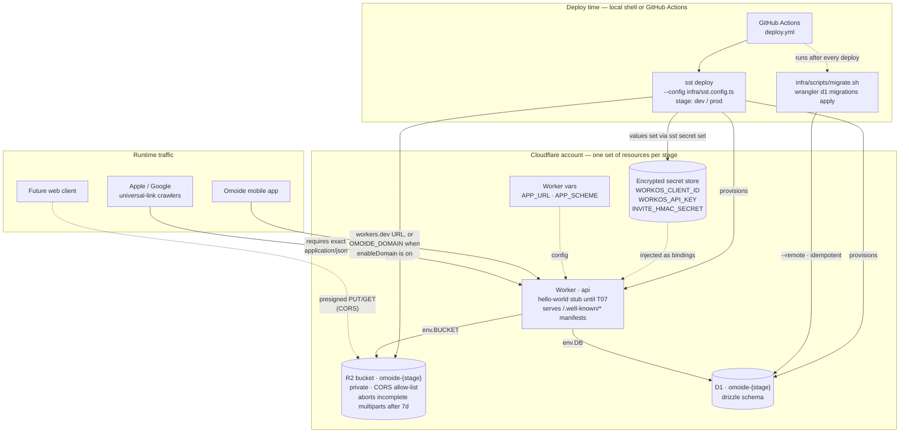

# Omoide infra — SST v4 (Ion) on Cloudflare

`sst deploy` provisions the Worker, R2 bucket, D1 database, secrets and
CORS/lifecycle rules that `apps/api` binds against (CONTRACTS.md §8). PRD §10
chose SST over Alchemy/Terraform/wrangler-only; do not relitigate here.

## Architecture

GitHub renders Mermaid natively — the diagram below is the whole picture:
what `sst deploy` provisions per stage, how the Worker binds to it, and where
runtime traffic enters. Solid arrows are provisioned bindings, dotted arrows
are config injection or future paths.



Stage isolation: every resource name carries its stage (`omoide-dev`,
`omoide-prod`), and prod is protected (`sst remove` refuses) and retained on
teardown. Custom-domain routing only exists when `OMOIDE_ENABLE_DOMAIN=true`;
otherwise the Worker answers on its workers.dev URL.

## Stack layout

| File | Resource |
|---|---|
| `sst.config.ts` | app config, stage gating (prod is protected + retained) |
| `storage.ts` | R2 bucket + CORS allow-list + multipart-abort lifecycle |
| `database.ts` | D1 database, physical name pinned to `omoide-<stage>` |
| `secrets.ts` | WorkOS + invite-HMAC secret declarations |
| `api.ts` | the API Worker (custom-domain route behind a flag) |
| `sst-globals.d.ts` | local types for SST globals (see note below) |
| `scripts/migrate.sh` | post-deploy D1 migration apply (idempotent) |

`sst.config.ts` normally references the generated
`.sst/platform/config.d.ts`, but that pulls the platform's `.ts` sources into
the program and they don't compile under the repo's TypeScript 6 yet.
`sst-globals.d.ts` provides equivalent ambient types instead — extend it when
you use new components. The SST CLI itself runs the config fine regardless.

## Required env vars

Exported in your shell or set as GitHub secrets for CI:

| Var | Used by | Notes |
|---|---|---|
| `CLOUDFLARE_API_TOKEN` | provider, wrangler | scoped token; needs Workers Scripts:Edit, R2:Edit, D1:Edit on the account |
| `CLOUDFLARE_ACCOUNT_ID` | provider, wrangler, raw resources | required even for `sst diff` |

Optional:

| Var | Default | Notes |
|---|---|---|
| `OMOIDE_ENABLE_DOMAIN` | `false` | gate custom-domain routing; zone must already be on Cloudflare (manual step) |
| `OMOIDE_DOMAIN` | – | e.g. `api.omoide.app`; required when the flag above is true |
| `APP_URL` / `APP_SCHEME` | `https://omoide.app` / `omoide://` | Worker vars (CONTRACTS §8) |

## Secrets

Declared in `infra/secrets.ts`, values live per stage in SST's encrypted
store — never in git or plain vars:

```
npx sst secret set WORKOS_CLIENT_ID --stage dev --config infra/sst.config.ts
npx sst secret set WORKOS_API_KEY --stage dev --config infra/sst.config.ts
npx sst secret set INVITE_HMAC_SECRET --stage dev --config infra/sst.config.ts
```

Local dev uses SST's own dev mode (`sst dev`), which injects linked secrets,
bucket and DB bindings into the running worker the same way deploy does — no
separate `.env` plumbing for T07 to wire up. Set secrets per stage once and
both `sst dev` and `sst deploy` see them.

## Deploy

```
pnpm install
export CLOUDFLARE_ACCOUNT_ID=... CLOUDFLARE_API_TOKEN=...
pnpm exec sst deploy --config infra/sst.config.ts --stage dev  # worker + bucket + db + rules
./infra/scripts/migrate.sh dev                                 # applies packages/db/migrations via wrangler
```

Migration apply is idempotent (wrangler tracks applied files in the
`d1_migrations` table). The D1 physical name is deterministic
(`omoide-<stage>`) so scripts never scrape state.

## Domainless fallback

No domain yet? Do nothing. The stack deploys to a workers.dev URL
(`worker.url` output). When the zone lands on Cloudflare:

```
OMOIDE_ENABLE_DOMAIN=true OMOIDE_DOMAIN=api.omoide.app pnpm exec sst deploy --config infra/sst.config.ts --stage prod
```

## Universal links (AASA / assetlinks)

The Worker serves `/.well-known/apple-app-site-association` and
`/assetlinks.json`. **Apple requires exactly `application/json`** (no charset
suffix, no trailing whitespace issues) — AASA failures are silent, so don't
touch those headers when replacing the handler in T14.

## CI deploys

`.github/workflows/deploy.yml` deploys prod on push to main. Auth today is a
scoped `CLOUDFLARE_API_TOKEN` repo secret. GitHub OIDC federation is **not**
supported natively by Cloudflare yet (wrangler-action#402 open); the workflow
requests `id-token: write` so an exchange/broker step can slot in without
permission changes. Log dissent or progress in the T04 async log.

## After first deploy — human checks

- Cloudflare dashboard → R2 → bucket → Settings: confirm the CORS policy and
  the `abort-incomplete-multipart-7d` lifecycle rule actually landed.
  Provider support for these settings has been uneven historically.
